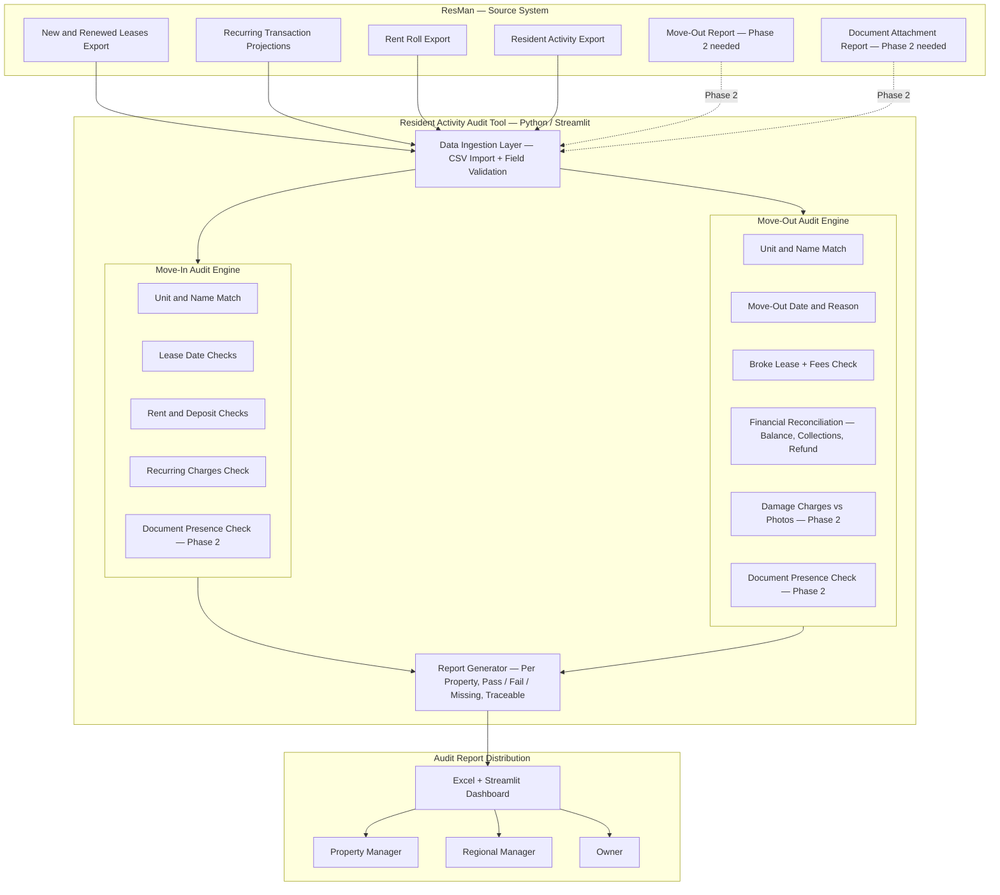

# Resident Activity Audit Tool — Architecture Diagram

**Prepared for:** Partha Balakrishnan / Development Team  
**Date:** July 23, 2026  
**Project:** LNJ Resident Activity Audit Tool (Move-In & Move-Out Audit)

---

---

## Phase 1 — Automated with Existing CSV Data

| Check | Data Source |
|---|---|
| Unit number match | Leases CSV |
| Resident name match | Leases CSV |
| Lease start / end / move-in dates | Leases CSV |
| Rent charge amount | Leases CSV + Rent Roll |
| Recurring charges present | Recurring Projection CSV |
| Required deposit vs. paid | Leases CSV |
| Move-out date | Resident Activity CSV |
| Broke lease flag + fees | Leases + Transactions CSV |
| Balance / financial reconciliation | Rent Roll + Transactions CSV |

## Phase 2 — Requires New ResMan Exports

| Check | What is Needed from ResMan |
|---|---|
| Lease / ID / Insurance doc uploaded? | Document Attachment Report |
| Move-out photos present? | Document Attachment Report |
| Complete lease package uploaded? | Document Attachment Report |
